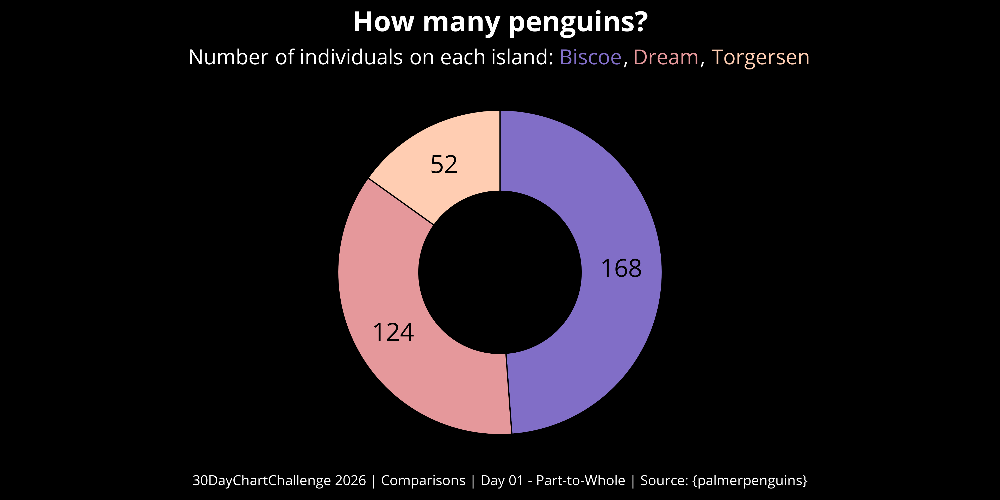
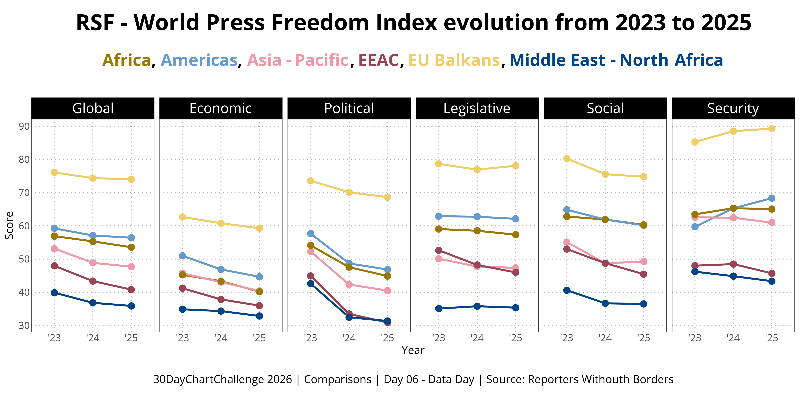

This year, I took part in the #30DayChartChallenge, in which participants can create a chart inspired by the daily prompt.

This yearly challenge is organised by Cédric Scherer and Dominic Royé, with prompts split across five categories, as shown below:

[{fig-align="center" width="600"}](https://www.linkedin.com/posts/30daychartchallenge-dataviz-datastorytelling-share-7440028455272005632-3R8I/?utm_source=share&utm_medium=member_desktop&rcm=ACoAAC-iIt0B3IYD5aTgYOAA5ObGYE760d5zxwY)

<br>

For the 2026 edition, I managed to create 6 charts:

::: {layout-nrow="2"}




:::

Here are the list of packages I used to create the charts:

| 📦 Package         | Usage |
|--------------------|-------|
| `{tidyverse}`      |       |
| `{palmerpenguins}` |       |
| `{ggtext}`         |       |
| `{showtext}`       |       |
| `{ggpop}`          |       |
| `{marimekko}`      |       |
| `{patchwork}`      |       |

<br>

I used the following data sets:

| Prompt | Data |
|----|----|
| Day 1: Part-to-Whole | `penguins` |
| Day 2: Pictogram | `penguins` |
| Day 3: Mosaic | `penguins` |
| Day 4: Slope | `penguins` |
| Day 5: Experimental | simulation of dice rolls |
| Day 6 (Data Day): Reporters Without Borders | [RSF World Freedom Index](https://rsf.org/en/rsf-world-press-freedom-index-2025-economic-fragility-leading-threat-press-freedom?year=2025&data_type=general) |

# Day One: Part-to-Whole

```{r}
#| code-fold: true
#| eval: false

# 📦 Packages ----

library(tidyverse)
library(palmerpenguins)
library(ggtext)
library(showtext)

# ⚙️ Define plot parameters ----

font_add_google("Open Sans")
showtext::showtext_auto()

# 📊 Plot ----

p <- penguins |> 
  count(island, name = "count") |> 
  mutate(fraction = count / sum(count),
         ymax = cumsum(fraction),
         ymin = lag(ymax, default = 0),
         label_y = (ymax + ymin) / 2) |> 
  ggplot(aes(xmin = 3, xmax = 4,
             ymin = ymin, ymax = ymax,
             fill = island)) +
  geom_rect(show.legend = FALSE,
            color = "black") +
  scale_fill_manual(
    values = c("Biscoe" = "#816ec7",
               "Dream" = "#e5989b",
               "Torgersen" = "#ffcdb2")
  ) +
  geom_text(x = 3.5, aes(y = label_y, label = count),
            size = 25, family = "Open Sans") +
  coord_polar(theta = "y") +
  xlim(c(2, 4)) +
  labs(title = "How many penguins?",
       subtitle = "Number of individuals on each island: <span style = 'color:#816ec7;'>Biscoe</span>,
       <span style = 'color:#e5989b;'>Dream</span>,
       <span style = 'color:#ffcdb2;'>Torgersen</span>",
       caption = "30DayChartChallenge 2026 | Comparisons | Day 01 - Part-to-Whole | Source: {palmerpenguins}") +
  theme_void() +
  theme(
    panel.background = element_rect(fill = "black", color = "black"),
    plot.background = element_rect(fill = "black", color = "black"),
    plot.title = element_text(family = "Open Sans", face = "bold", 
                              colour = "white", size = 80, hjust = 0.5,
                              margin = margin(t = 10)),
    plot.subtitle = element_markdown(family = "Open Sans", 
                                     colour = "white", size = 60, hjust = 0.5,
                                     margin = margin(t = 10)),
    plot.caption = element_text(family = "Open Sans", colour = "white",
                                size = 40, hjust = 0.5, 
                                margin = margin(b = 10))
  )

# 💾 Save plot ----

ggsave("2026/figs/30DCC_2026_01.png", p, dpi = 320,
       width = 12, height = 6)
```

{fig-align="center"}

# Day Two: Pictogram

```{r}
#| code-fold: true
#| eval: false
# 📦 Packages ----

library(tidyverse)
library(palmerpenguins)
library(ggpop)
library(ggtext)
library(showtext)

# ⚙️ Define plot parameters ----

font_add_google("Open Sans")
showtext::showtext_auto()

# 📊 Plot ----

penguins_species <- penguins |> 
  count(species, sort = TRUE) |> 
  mutate(percent = round(100 * n / sum(n)))

p <- tibble(
  x = rep(1:10, times = 10), 
  y = rep(1:10, each = 10),
  species = c(rep("Adelie", penguins_species$percent[1]),
              rep("Gentoo", penguins_species$percent[2]),
              rep("Chinstrap", penguins_species$percent[3]))) |> 
  ggplot(aes(x, y, color = species)) +
  geom_icon_point(icon = "linux", size = 2.5) +
  scale_color_manual(
    values = c("Adelie" = "darkorange",
               "Chinstrap" = "purple",
               "Gentoo" = "cyan4")
  ) +
  geom_text(x = 12, y = 9.5, label = "Chinstrap: 20% (n = 20)",
            hjust = 0, family = "Open Sans", fontface = "bold", size = 20, color = "purple") +
  geom_text(x = 12, y = 6.5, label = "Gentoo: 36% (n = 124)",
            hjust = 0, family = "Open Sans", fontface = "bold", size = 20, color = "cyan4") +
  geom_text(x = 12, y = 3, label = "Adelie: 44% (n = 152)",
            hjust = 0, family = "Open Sans", fontface = "bold", size = 20, color = "darkorange") +
  labs(title = "How many penguins?",
       subtitle = "Number of individuals per species",
       caption = "30DayChartChallenge 2026 | Comparisons | Day 02 - Pictogram | Source: {palmerpenguins}") +
  scale_x_continuous(limits = c(-1, 20)) +
  scale_y_continuous(limits = c(0, 11)) +
  theme_void() +
  theme(
    panel.background = element_rect(fill = "white", color = "white"),
    plot.background = element_rect(fill = "white", color = "white"),
    plot.title = element_text(family = "Open Sans", face = "bold", 
                              colour = "black", size = 80, hjust = 0.5,
                              margin = margin(t = 10)),
    plot.subtitle = element_text(family = "Open Sans", 
                                     colour = "black", size = 60, hjust = 0.5,
                                     margin = margin(t = 10)),
    plot.caption = element_text(family = "Open Sans", colour = "black",
                                size = 40, hjust = 0.5, 
                                margin = margin(b = 10)),
    legend.position = "none"
  )

# 💾 Save plot ----

ggsave("2026/figs/30DCC_2026_02.png", p, dpi = 320, width = 12, height = 6)
```

{fig-align="center"}

# Day Three: Mosaic

```{r}
#| code-fold: true
#| eval: false
# 📦 Packages ----

library(tidyverse)
library(palmerpenguins)
library(marimekko)
library(showtext)
library(ggtext)

# ⚙️ Define plot parameters ----

font_add_google("Open Sans")
showtext::showtext_auto()

# 📊 Plot ----

p <- ggplot(penguins) +
  geom_marimekko(aes(fill = factor(species)),
                 formula = ~ island | species) +
  geom_marimekko_text(aes(label = after_stat(paste0(round(cond_prop * 100), "%"))),
                      family = "Open Sans", size = 20) +
  scale_fill_manual(values = c("Adelie" = "darkorange",
                               "Chinstrap" = "purple",
                               "Gentoo" = "cyan4")) +
  labs(title = "How many penguins?",
       subtitle = "Proportion of species (<span style = 'color:#ff8c00;'>Adelie</span>,
       <span style = 'color:#a020f0;'>Chinstrap</span>,
       <span style = 'color:#008b8b;'>Gentoo</span>) on each island",
       caption = "30DayChartChallenge 2026 | Comparisons | Day 03 - Mosaic | Source: {palmerpenguins}") +
  theme_minimal() +
  theme(axis.title = element_blank(),
        axis.text.x = element_text(family = "Open Sans", size = 50, color = "white"),
        axis.text.y = element_blank(),
        axis.ticks = element_blank(),
        legend.position = "none",
        panel.background = element_rect(fill = "black", color = "black"),
        panel.grid = element_blank(),
        plot.background = element_rect(fill = "black", color = "black"),
        plot.title = element_text(family = "Open Sans", face = "bold", color = "white", size = 80, hjust = 0.5, margin = margin(t = 15, b = 10)),
        plot.subtitle = element_markdown(family = "Open Sans", color = "white", size = 60, hjust = 0.5, margin = margin(b = 30)),
        plot.caption = element_text(family = "Open Sans", color = "white", size = 40, hjust = 0.5, margin = margin(t = 25, b = 15)))

# 💾 Save plot ----

ggsave("2026/figs/30DCC_2026_03.png", p, dpi = 320, width = 12, height = 6)
```

{fig-align="center"}

# Day Four: Slope

```{r}
#| code-fold: true
#| eval: false
# 📦 Packages ----

library(tidyverse)
library(palmerpenguins)
library(showtext)

# ⚙️ Define plot parameters ----

font_add_google("Open Sans")
showtext::showtext_auto()

theme_set(theme_bw())

# 📊 Plot ----

p <- penguins |> 
  ggplot(aes(x = flipper_length_mm, y = bill_length_mm,
             color = species, fill = species)) +
  geom_point(shape = 21, size = 3, alpha = 0.5) +
  geom_smooth(method = "lm", se = FALSE, linewidth = 1.5) +
  scale_color_manual(
    values = c("Adelie" = "darkorange",
               "Chinstrap" = "purple",
               "Gentoo" = "cyan4")
  ) +
  scale_fill_manual(
    values = c("Adelie" = "darkorange",
               "Chinstrap" = "purple",
               "Gentoo" = "cyan4")
  ) +
  facet_wrap(~species) +
  labs(title = "Relation between flipper length and bill length",
       x = "Flipper length (mm)",
       y = "Bill length (mm)",
       caption = "30DayChartChallenge 2026 | Comparisons | Day 04 - Slope | Source: {palmerpenguins}") +
  theme(legend.position = "none",
        panel.grid.minor = element_blank(),
        panel.grid.major = element_line(colour = "white", linetype = "dotted",
                                        linewidth = 0.2),
        panel.background = element_rect(fill = "black", colour = "black"),
        plot.background = element_rect(fill = "black", colour = "black"),
        plot.title = element_text(family = "Open Sans", face = "bold", colour = "white", 
                                  size = 80, hjust = 0.5, margin = margin(t = 10, b = 20)),
        plot.caption = element_text(family = "Open Sans", colour = "white",
                                    size = 40, hjust = 0.5, 
                                    margin = margin(t = 20, b = 10)),
        axis.title = element_text(family = "Open Sans", colour = "white", size = 40),
        axis.text = element_text(family = "Open Sans", colour = "white", size = 34),
        axis.text.x = element_text(margin = margin(t = 10, b = 10)),
        axis.text.y = element_text(margin = margin(l = 10, r = 10)),
        strip.background = element_rect(colour="white", fill="white"),
        strip.text = element_text(family = "Open Sans", colour = "black", size = 50))

# 💾 Save plot ----

ggsave("2026/figs/30DCC_2026_04.png", p, dpi = 320, width = 12, height = 6) 
```

{fig-align="center"}

# Day Five: Experimental

```{r}
#| code-fold: true
#| eval: false
# 📦 Packages ----

library(tidyverse)
library(patchwork)
library(showtext)
library(ggtext)

# ⚙️ Define plot parameters ----

font_add_google("Open Sans")
showtext::showtext_auto()

# ⚒️ Function ----

plot_rolls <- function(n_dice, n_rolls, seed = 42) {
  
  dice_theo <- tibble(
    stack(
      prop.table(
        table(rowSums(expand.grid(rep(list(1:6), n_dice)))
              )
        )
      )
    ) |> 
    select(dice_total = ind, prob_theo = values) |> 
    mutate(n_dice = n_dice, n_rolls = n_rolls,
           .before = dice_total)
  
  set.seed(seed)
  
  sim_res <- list()
  
  for (i in 1:n_dice) {
    sim_res[[i]] <- sample(x = 1:6, size = n_rolls, replace = TRUE)
  }
  
  res <- tibble(
    dice_total = Reduce("+", sim_res)
  ) |> 
    count(dice_total) |> 
    mutate(prop_obs = n / sum(n),
           dice_total = factor(dice_total)) |> 
    select(!n)
  
  dice_res <- dice_theo |> 
    left_join(res) |> 
    select(n_dice, n_rolls, everything()) |> 
    replace_na(list(prop_obs = 0))
  
  ggplot(dice_res) +
    geom_col(aes(x = dice_total, y = prop_obs),
             fill = "#ffbbff") +
    geom_line(aes(x = dice_total, y = prob_theo, group = 1),
                color = "purple", linewidth = 2) +
    labs(x = "Sum of dice", y = "Probability",
         title = paste0("Simulating ", n_rolls, " throws of ", n_dice, " dice"),
         subtitle = "<span style = 'color:#ffbbff;'>Simulated values</span> versus
       <span style = 'color:#a020f0;'>expected values</span>",
         caption = "30DayChartChallenge 2026 | Comparisons | Day 05 - Experimental") +
    theme_bw() +
    theme(panel.grid.minor = element_blank(),
          panel.grid.major.x = element_blank(),
          panel.grid.major.y = element_line(colour = "grey", linewidth = 0.4, linetype = "dotted"),
          panel.background = element_rect(fill = "black", colour = "black"),
          plot.background = element_rect(fill = "black", colour = "black"),
          plot.title = element_text(family = "Open Sans", face = "bold", 
                                    colour = "white", size = 80, margin = margin(t = 20, b = 10)),
          plot.subtitle = element_markdown(family = "Open Sans", size = 50, 
                                           colour = "white", margin = margin(b = 10)),
          plot.caption = element_text(family = "Open Sans", colour = "white",
                                      size = 40, hjust = 0.5, 
                                      margin = margin(t = 20, b = 10)),
          axis.ticks = element_blank(),
          axis.title.x = element_text(family = "Open Sans", colour = "white", size = 60,
                                      margin = margin(t = 25)),
          axis.title.y = element_text(family = "Open Sans", colour = "white", size = 60,
                                      margin = margin(r = 25)),
          axis.text = element_text(family = "Open Sans", colour = "white",
                                   size = 40))
  
}

# 📊 Plot ----

p <- plot_rolls(n_dice = 3, n_rolls = 1000, seed = 42)

# 💾 Save plot ----

ggsave("2026/figs/30DCC_2026_05.png", p, dpi = 320, width = 12, height = 6)
```

{fig-align="center"}

# Day Six: Reporters Without Borders

```{r}
#| code-fold: true
#| eval: false
# 📦 Packages ----

library(tidyverse)
library(showtext)
library(ggtext)

# ⚙️ Define plot parameters ----

font_add_google("Open Sans")
showtext::showtext_auto()

theme_set(theme_bw())

# 📄 Data ----

rsf_index_2023 <- read_csv2("2026/data/2023.csv")
rsf_index_2024 <- read_csv2("2026/data/2024.csv")
rsf_index_2025 <- read_csv2("2026/data/2025.csv")

rsf_index_2023 <- rsf_index_2023 |> 
  summarise(Global = mean(Score),
            Economic = mean(`Economic Context`),
            Political = mean(`Political Context`),
            Legislative = mean(`Legal Context`),
            Social = mean(`Social Context`),
            Security = mean(Safety),
            .by = Zone) |> 
  mutate(Zone = case_when(Zone == "UE Balkans" ~ "EU Balkans",
                          Zone == "Asie-Pacifique" ~ "Asia - Pacific",
                          Zone == "Amériques" ~ "Americas",
                          Zone == "Afrique" ~ "Africa",
                          Zone == "MENA" ~ "Middle East - North Africa",
                          .default = "EEAC")) |> 
  pivot_longer(cols = -Zone, 
               names_to = "Indicator",
               values_to = "Score") |> 
  mutate(Year = 2023, .before = Zone)

rsf_index_2024 <- rsf_index_2024 |> 
  summarise(Global = mean(Score),
            Economic = mean(`Economic Context`),
            Political = mean(`Political Context`),
            Legislative = mean(`Legal Context`),
            Social = mean(`Social Context`),
            Security = mean(Safety),
            .by = Zone) |> 
  mutate(Zone = case_when(Zone == "UE Balkans" ~ "EU Balkans",
                          Zone == "Asie-Pacifique" ~ "Asia - Pacific",
                          Zone == "Amériques" ~ "Americas",
                          Zone == "Afrique" ~ "Africa",
                          Zone == "MENA" ~ "Middle East - North Africa",
                          .default = "EEAC")) |> 
  pivot_longer(cols = -Zone, 
               names_to = "Indicator",
               values_to = "Score") |> 
  mutate(Year = 2024, .before = Zone)

rsf_index_2025 <- rsf_index_2025 |> 
  summarise(Global = mean(`Score 2025`),
            Economic = mean(`Economic Context`),
            Political = mean(`Political Context`),
            Legislative = mean(`Legal Context`),
            Social = mean(`Social Context`),
            Security = mean(Safety),
            .by = Zone) |> 
  mutate(Zone = case_when(Zone == "UE Balkans" ~ "EU Balkans",
                          Zone == "Asie-Pacifique" ~ "Asia - Pacific",
                          Zone == "Am\xe9riques" ~ "Americas",
                          Zone == "Afrique" ~ "Africa",
                          Zone == "MENA" ~ "Middle East - North Africa",
                          .default = "EEAC")) |> 
  pivot_longer(cols = -Zone, 
               names_to = "Indicator",
               values_to = "Score") |> 
  mutate(Year = 2025, .before = Zone)

rsf_index <- bind_rows(rsf_index_2023, rsf_index_2024, rsf_index_2025) |> 
  mutate(Indicator = factor(Indicator, levels = c("Global", "Economic", "Political", "Legislative",
                                                  "Social", "Security")),
         Year = str_replace_all(Year, "20", "'"))

rm(rsf_index_2023, rsf_index_2024, rsf_index_2025)

# 📊 Plot ----

p <- ggplot(rsf_index,
       aes(x = Year, y = Score)) +
  geom_line(aes(color = Zone, group = Zone), linewidth = 1) +
  geom_point(aes(color = Zone), size = 3) +
  scale_color_manual(values = c("EU Balkans" = "#eecc66",
                                "Asia - Pacific" = "#ee99aa",
                                "Americas" = "#6699cc",
                                "Africa" = "#997700",
                                "EEAC" = "#994455",
                                "Middle East - North Africa" = "#004488")) +
  facet_wrap(~Indicator, nrow = 1) +
  labs(title = "RSF - World Press Freedom Index evolution from 2023 to 2025",
       subtitle = "<span style = 'color:#997700;'>Africa</span>, <span style = 'color:#6699cc;'>Americas</span>,
       <span style = 'color:#ee99aa;'>Asia - Pacific</span>, <span style = 'color:#994455;'>EEAC</span>,
       <span style = 'color:#eecc66;'>EU Balkans</span>, <span style = 'color:#004488;'>Middle East - North Africa</span>",
       caption = "30DayChartChallenge 2026 | Comparisons | Day 06 - Data Day | Source: Reporters Withouth Borders") +
  theme(legend.position = "none",
        axis.ticks = element_blank(),
        axis.title = element_text(family = "Open Sans", size = 40),
        axis.text = element_text(family = "Open Sans", size = 35),
        panel.grid.minor = element_blank(),
        panel.grid.major = element_line(linetype = "dotted", color = "grey70", linewidth = 0.5),
        plot.title = element_text(family = "Open Sans", face = "bold", colour = "black", 
                                  size = 80, hjust = 0.5, margin = margin(t = 10, b = 20)),
        plot.subtitle = element_markdown(family = "Open Sans", face = "bold", color = "black", size = 60, hjust = 0.5, margin = margin(b = 30)),
        plot.caption = element_text(family = "Open Sans", colour = "black",
                                    size = 40, hjust = 0.5, 
                                    margin = margin(t = 20, b = 10)),
        strip.background = element_rect(colour="black", fill="black"),
        strip.text = element_text(family = "Open Sans", colour = "white", size = 50))

# 💾 Save plot ----

ggsave("2026/figs/30DCC_2026_06.png", p, dpi = 320, width = 12, height = 6)
```

{fig-align="center"}
