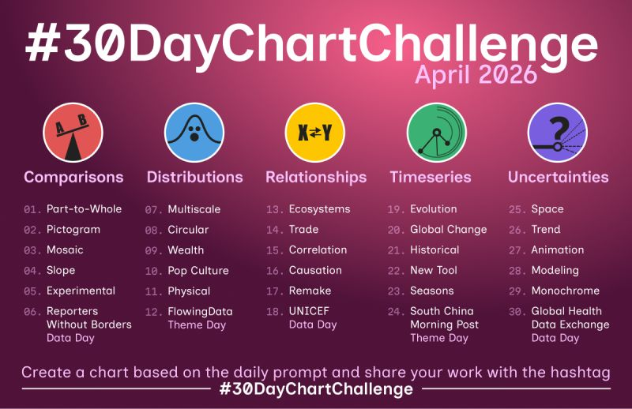
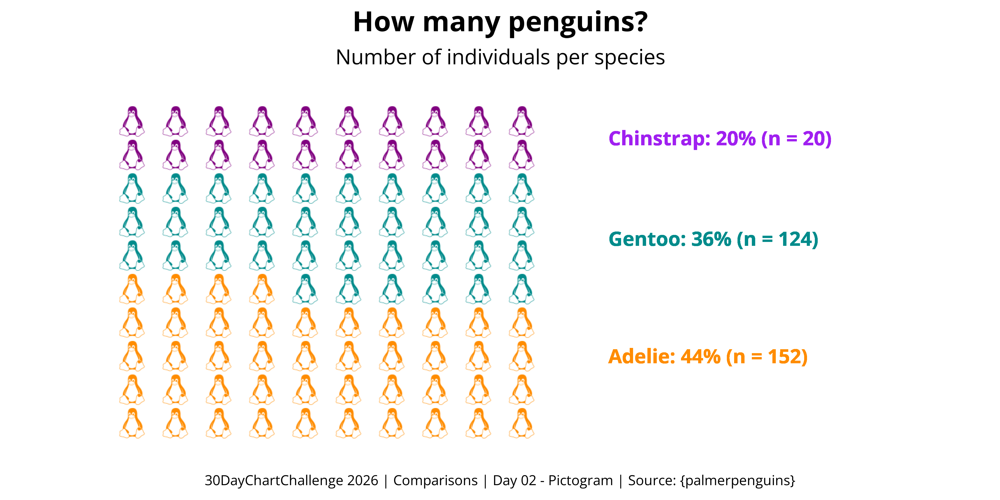
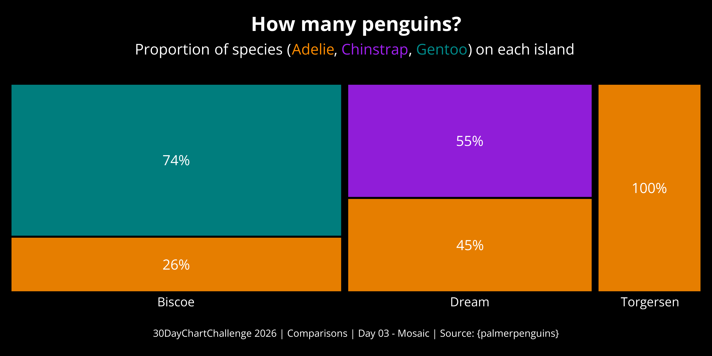
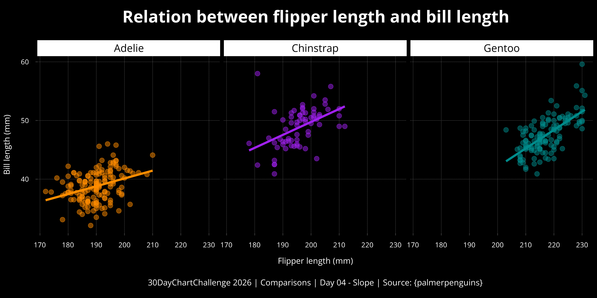
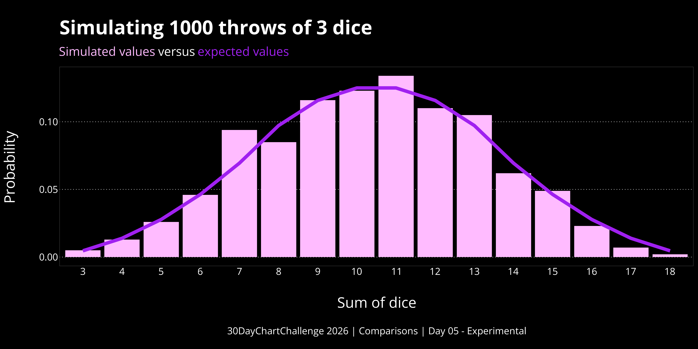

This year, I took part in the #30DayChartChallenge, in which participants can create a chart inspired by the daily prompt.

This yearly challenge is organised by Cédric Scherer and Dominic Royé, with prompts split across five categories, as shown below:

[{fig-align="center"}](https://www.linkedin.com/posts/30daychartchallenge-dataviz-datastorytelling-share-7440028455272005632-3R8I/?utm_source=share&utm_medium=member_desktop&rcm=ACoAAC-iIt0B3IYD5aTgYOAA5ObGYE760d5zxwY)

 

For the 2026 edition, I managed to create 6 charts:

::: {layout-nrow="2"}

:::
